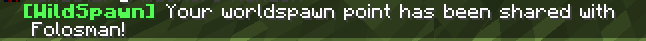
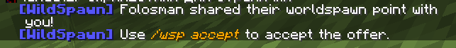

# WildSpawn
WildSpawn's sole purpose is to spread players far apart from eachother while retaining some sense of being fair to them.  

### Why
* Vanilla's `spawnRadius` gamerule is okay but generally unfair for players if set to a large value, say 10000 blocks.
* A little something called "NRMC manifesto", which is a (WIP) piece of media full of recomendations for setting up an SMP to be perfect from my point of view. This "manifesto" includes _survival first, multiplayer second_ entry.

### How it works
* When the player first joins a server, the plugin will then generate a random 2D vector (X and Z coordinates) within a specific "global" spawn radius.
* When it's time to respawn whilst not having a valid bed or an anchor, the plugin takes a random offset within a `spawnRadius` gamerule's value and adds it to the previously calculated spawn point.
* The new two values are the now the player's spawn location!

**In simple terms:** vanilla spawns all players around one single point, WildSpawn spawns every player around their own little randomly generated point.

# Usage examples
1. Randomizing your own spawn point - `/wsp randomize`:
   
   
2. Sharing your spawn point with others - `/wsp share %playername%`:
   
3. Accepting a shared spawn point - `/wsp accept`:
   
   
   
4. Or politely rejecting it - `/wsp deny`:
   

# Configuration
Example config:
```yaml
# plugins/WildSpawn/config.yml
global_spawn_radius: 10000
```

The value of `global_spawn_radius` defines the radius in which worldspawn point coordinates will be chosen randomly when required. These values (best case scenario) are chosen only ONCE, and then a value offset using the vanilla `spawnRadius` is used as a spawn location.
